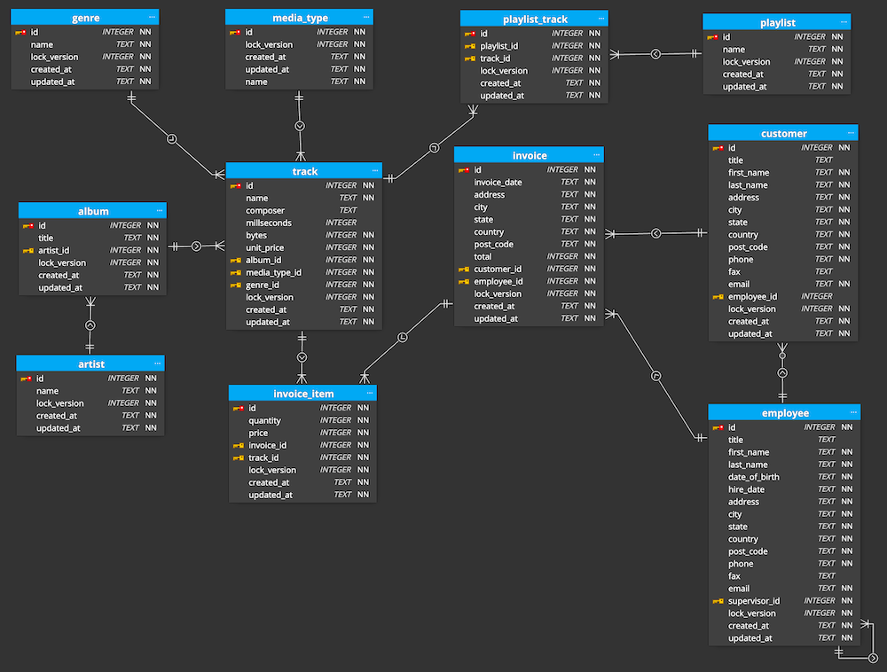
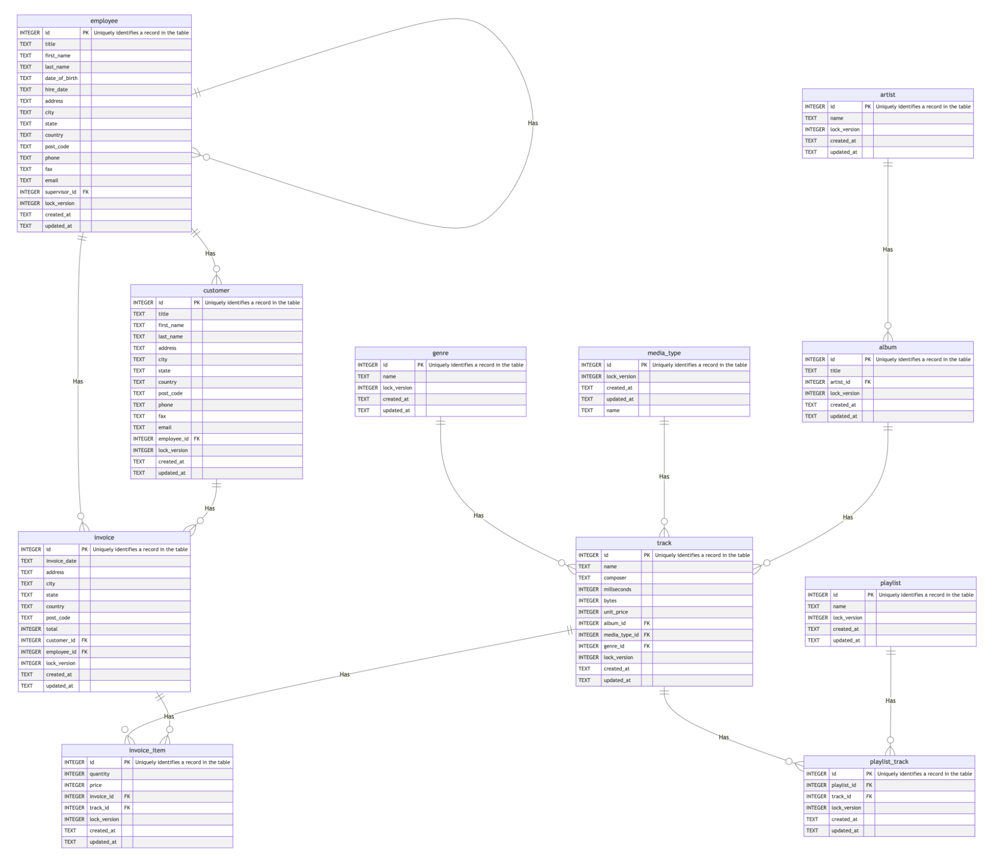
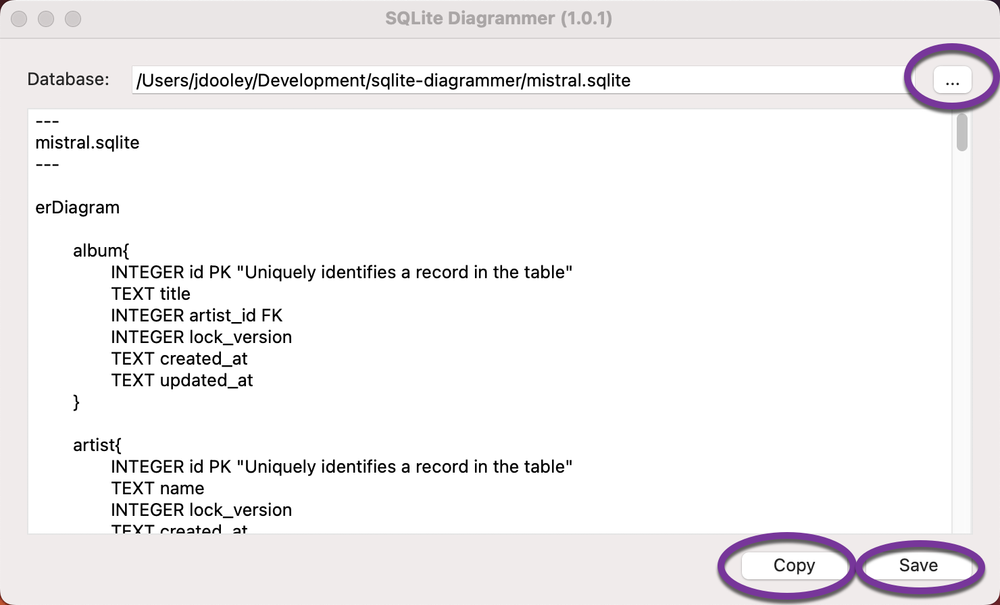

# SQLite Diagrammer

## Introduction

This is a simple little utility that reads the database schema from an SQLite database file and generates an ER diagram using [mermaid.js](https://mermaid.js.org/intro/).  The generated text file can be enhanced by adding additional comments, changing the relationship types and adding various style elements (see the [mermaid documentation](https://mermaid.js.org/syntax/entityRelationshipDiagram.html) for details).

Visual Studio Code can be used to visual the diagram using the "Markdown Preview Mermaid Support" extension.

## Sample Database

This repository includes a sample database file for testing.  The database schema is described in the following diagram:

## Output

The following diagram was created from the text file generated by the application, without any additional enhancements:

## Usage

The application is very simple to use:

1. Select the database file by using the browse button at top right hand corner of the applications main window.
2. Use the copy button to place the generated code on the clipboard.
3. Use the save button to save the diagram in a markdown file.

## Files

The repository contains the following files:

| File | Description |
| ---- | ----------- |
| app_image.png | The application image displayed in this document |
| database_design.dmm | Luna Modeler file |
| er_diagram.png | The ER diagram displayed at the top of this document |
| icons.axicp | IconGenerator file |
| LICENSE | The license file |
| mermaid.png | The output of the application shown in this document |
| mistral_database.sql | An SQL script to generate the database (created by Luna Modeler) |
| mistral.sqlite | The SQLite database test file |
| README.md | The readme file |
| splash.jpg | The image displayed at the top of this document |
| sqlite_diagrammer.xojo_binary_project | The XOJO source code for the application |
